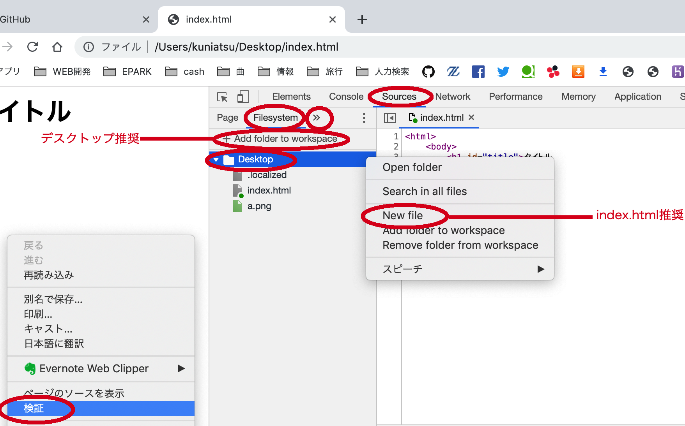

## 準備  

### エディッタの準備とファイルの作成


### コーディングの準備
```
<html>
<body>
画面表示
</body>
<script>
 alert("準備完了");
 console.dir("log出力");
</script>
</html>
```

### 前回までのマニュアル  


## 復習  
### 変数・if・whileの復習  
【問題】ループと分岐を使って下記のlogをコンソールに出しましょう   
 ` コンソールに出力するlog ` 
```
1
2
3
-
4
5
6
-
7
8
9
```
  
   
` ヒント!! `  
JavaScriptはhtmlファイルのscriptタグ内に書く。　　  
ループ(while)は１回、分岐(if)は2回使おう。    
まずループで1~9を表示させて、その後ifで「-」が出るようにしよう。  


### 関数作成  
【問題】引数に入れた数字に5を足した数をコンソールに出力する関数gotasuを作成   

` ヒント!! `  
gotasu(5); を実行するとコンソールに10が出力される。   


### HTMLの一部を取得    
【問題】画面にボタンとテキストボックスを作りボタンに書かれている文字とテキストボックス内に書かれている文字を取得しよう   
 `追加するタグ `  
```
<input id="tb" type="text" value="テキストボックス">
<button id="bt">ボタン</button>
```
   

 ` コンソールに出力するlog ` 
```
テキストボックス
ボタン
```
   

` ヒント!! `  
画面側の全ての情報はdocumentに入っている。    


### クリックイベント  
【問題】ボタンを押したら、テキストボックスに書かれた文字がコンソールに出力されるようにしましょう。

` ヒント!! `  
画面側の全ての情報はdocumentに入っている。   
クリックイベントはaddEventListener関数で追加できる。  
addEventListener関数の第1引数は"click"第2引数はクリックしたら走らせたい関数の名前。   


## 前から文字の切り抜き  
 ` 文字列.slice(開始位置 ,終了位置) ` 
数は0から始まる！


## 後ろから文字の切り抜き  
 ` 文字列.slice(開始位置 ,終了位置) ` 


## 配列  


## localStorage  

### 保存

### 読み出し